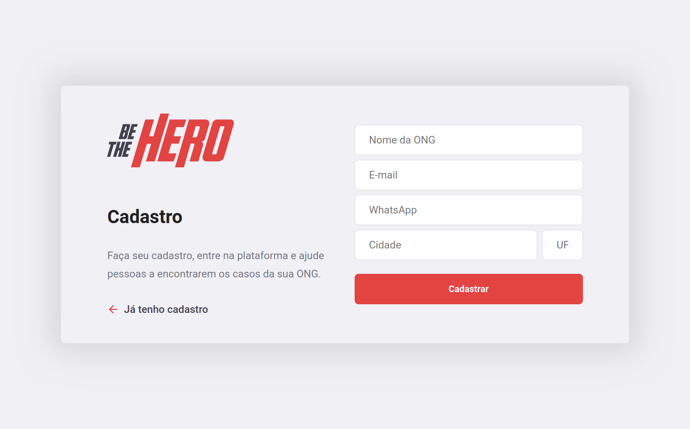
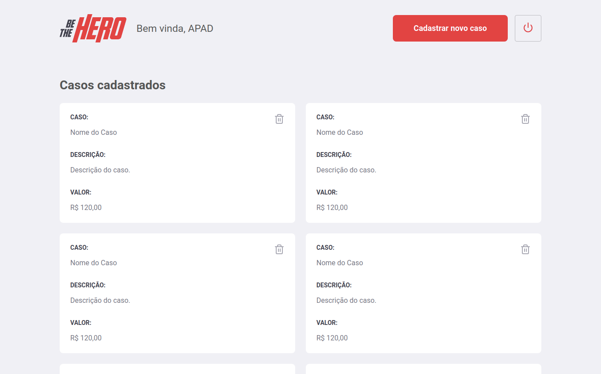
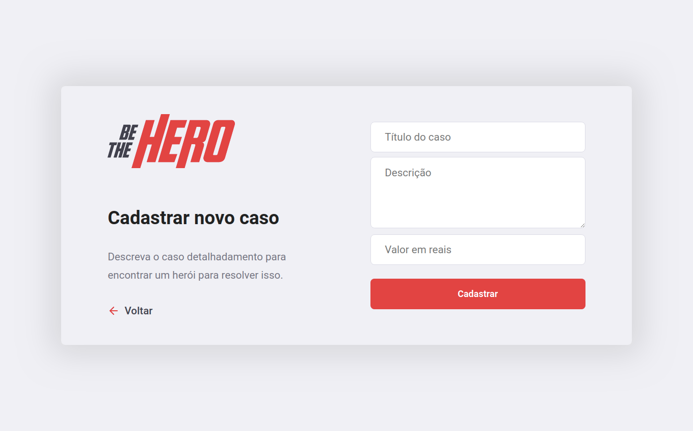
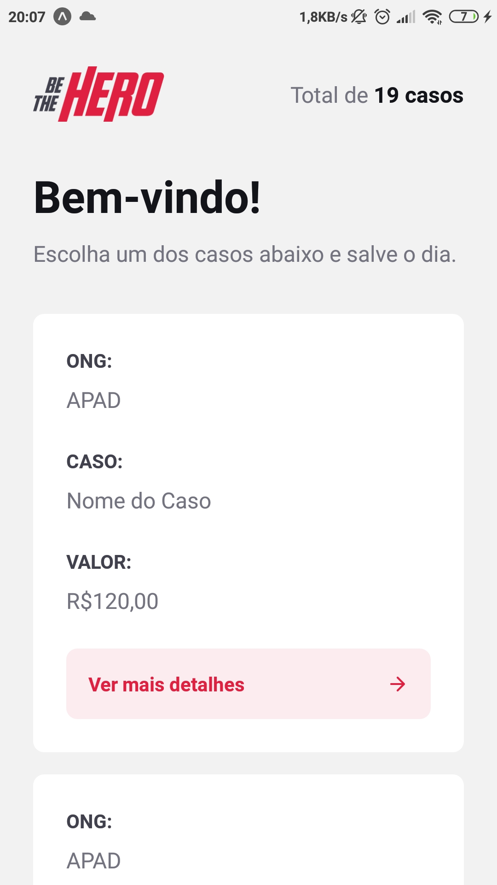
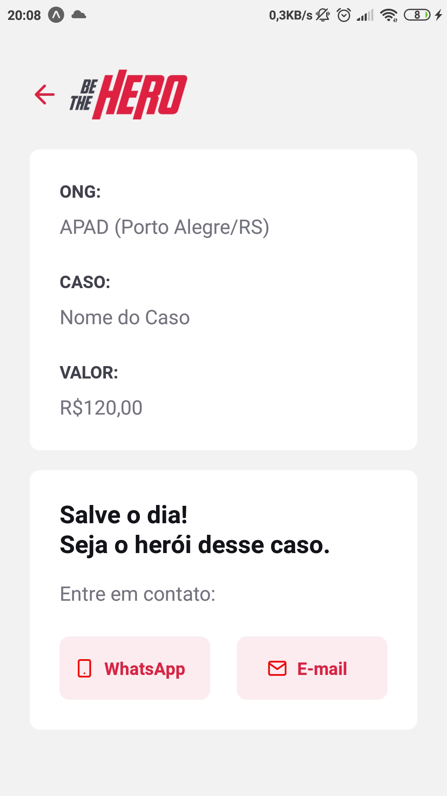

	

# Be The Hero

Projeto da Semana OmniStack 11.0.

## Frontend

Página inicial:

Página de cadastro de ONGs:

Perfil da ONG:

Cadastro de casos:

## Mobile

Início                                | Detalhes do caso
------------------------------------- | ----------------
 | 

## Backend API

<table>
	<thead>
		<tr>
			<th>Método</th>
			<th>Recurso</th>
			<th>Body</th>
			<th>Resposta</th>
		</tr>
	</thead>
	<tbody>
		<tr>
			<td>POST</td>
			<td>sessions</td>
			<td><pre lang="json">{ "id": "906b98b7" }</pre></td>
			<td><pre lang="json">{ "name": "APAD" }</pre></td>
		</tr>
		<tr>
			<td>GET</td>
			<td>ongs</td>
			<td>Empty</td>
			<td><pre lang="json">[{
  "id": "906b98b7",
  "name": "APAD",
  "email": "apad@apad.org",
  "whatsapp": "5599999999",
  "city": "São Paulo",
  "uf": "SP"
}]</pre></td>
		</tr>
		<tr>
			<td>POST</td>
			<td>ongs</td>
			<td><pre lang="json">{
  "name": "APAD",
  "email": "apad@apad.org",
  "whatsapp": "5599999999",
  "city": "São Paulo",
  "uf": "SP"
}</pre></td>
			<td><pre lang="json">{ "id": "906b98b7" }</pre></td>
		</tr>
		<tr>
			<td>GET</td>
			<td>ongs/:ong_id/incidents</td>
			<td>Empty</td>
			<td><pre lang="json">[{
  "id": 1,
  "title": "Case",
  "description": "Description.",
  "value": 120,
  "ong_id": "906b98b7"
}]</pre></td>
		</tr>
		<tr>
			<td>GET</td>
			<td>incidents</td>
			<td>Empty</td>
			<td><pre lang="json">[{
  "id": 1,
  "title": "Case",
  "description": "Description.",
  "value": 120,
  "ong_id": "906b98b7",
  "name": "APAD",
  "email": "apad@apad.org",
  "whatsapp": "5599999999",
  "city": "São Paulo",
  "uf": "SP"
}]</pre></td>
		</tr>
		<tr>
			<td>POST</td>
			<td>incidents</td>
			<td><pre lang="json">{
  "title": "Case",
  "description": "Description.",
  "value": 120
}</pre></td>
			<td><pre lang="json">{ "id": 1 }</pre></td>
		</tr>
		<tr>
			<td>DELETE</td>
			<td>incidents/:id</td>
			<td>Empty</td>
			<td>Empty</td>
		</tr>
	</tbody>
</table>
